# Oscars Dynamics Road Test

Generated from live Kalshi data on 2026-03-20T12:00:00+00:00.

This road test uses the current `mykalshi` research stack rather than notebook-only code. It demonstrates:

- multi-category event selection across recurring series
- event close-up quote panels
- market candlestick and comparison plots
- full trade-history loading plus trade-flow summaries
- live order book inspection on the next Oscars cycle

It also shows the current limitation clearly: without a prior websocket capture session, the toolkit cannot reconstruct **historical** Oscars order books tick by tick after the fact. It can analyze historical trades and quote candles, and it can inspect **current** live order books.

## Cross-category summary

- Categories analyzed: 8
- Pre-resolution favorite was correct in 100% of the analyzed categories.
- Most actively traded winner market: `KXOSCARACTO-26-MIC`

<table class="dataframe dataframe">
  <thead>
    <tr style="text-align: right;">
      <th>category</th>
      <th>event_ticker</th>
      <th>winner</th>
      <th>pre_resolution_favorite</th>
      <th>favorite_correct</th>
      <th>favorite_gap_cents</th>
      <th>winner_volume_contracts</th>
    </tr>
  </thead>
  <tbody>
    <tr>
      <td>Best Actor</td>
      <td>KXOSCARACTO-26</td>
      <td>Michael B. Jordan</td>
      <td>Michael B. Jordan</td>
      <td>True</td>
      <td>53.0</td>
      <td>6790274.0</td>
    </tr>
    <tr>
      <td>Best Actress</td>
      <td>KXOSCARACTR-26</td>
      <td>Jessie Buckley</td>
      <td>Jessie Buckley</td>
      <td>True</td>
      <td>97.0</td>
      <td>1705713.0</td>
    </tr>
    <tr>
      <td>Best Film Editing</td>
      <td>KXOSCAREDIT-26</td>
      <td>One Battle After Another</td>
      <td>One Battle After Another</td>
      <td>True</td>
      <td>78.0</td>
      <td>298776.0</td>
    </tr>
    <tr>
      <td>Best Original Score</td>
      <td>KXOSCARSCORE-26</td>
      <td>Sinners</td>
      <td>Sinners</td>
      <td>True</td>
      <td>85.0</td>
      <td>180568.0</td>
    </tr>
    <tr>
      <td>Best Original Song</td>
      <td>KXOSCARSONG-26</td>
      <td>Golden</td>
      <td>Golden</td>
      <td>True</td>
      <td>76.0</td>
      <td>591223.0</td>
    </tr>
    <tr>
      <td>Best Picture</td>
      <td>KXOSCARPIC-26</td>
      <td>One Battle After Another</td>
      <td>One Battle After Another</td>
      <td>True</td>
      <td>54.0</td>
      <td>5042079.0</td>
    </tr>
    <tr>
      <td>Best Supporting Actor</td>
      <td>KXOSCARSUPACTO-26</td>
      <td>Sean Penn</td>
      <td>Sean Penn</td>
      <td>True</td>
      <td>69.0</td>
      <td>1537236.0</td>
    </tr>
    <tr>
      <td>Best Supporting Actress</td>
      <td>KXOSCARSUPACTR-26</td>
      <td>Amy Madigan</td>
      <td>Amy Madigan</td>
      <td>True</td>
      <td>31.0</td>
      <td>1515572.0</td>
    </tr>
  </tbody>
</table>

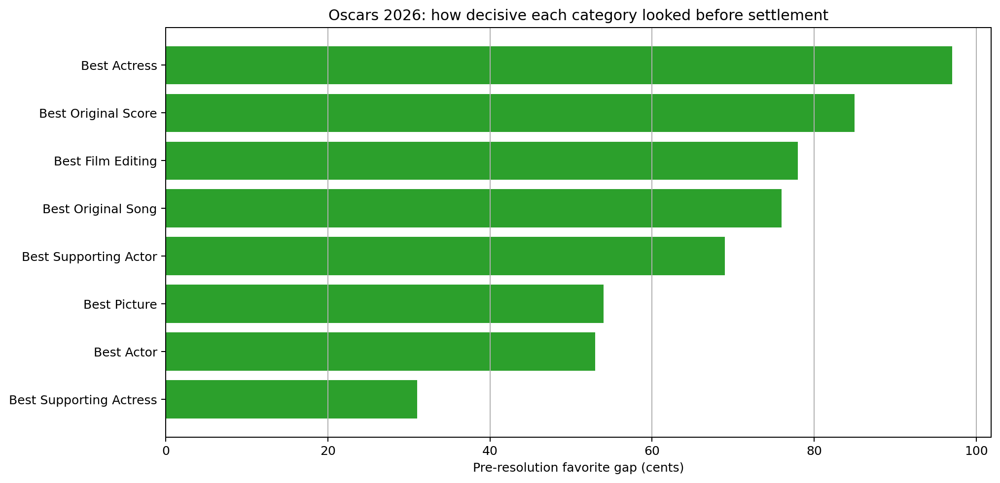

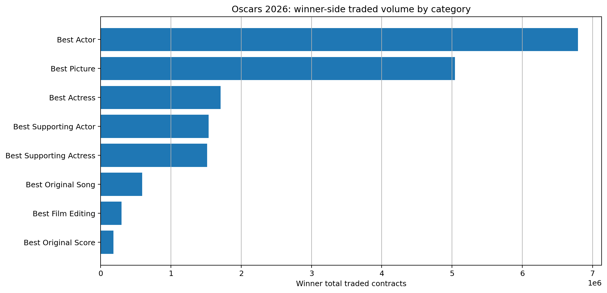

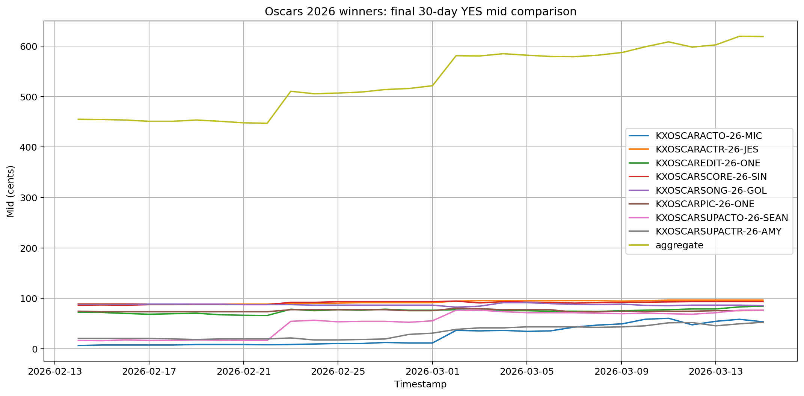

## Winner trade summaries

<table class="dataframe dataframe">
  <thead>
    <tr style="text-align: right;">
      <th>category</th>
      <th>ticker</th>
      <th>trade_count</th>
      <th>total_contracts</th>
      <th>vwap_yes_price_cents</th>
      <th>avg_trade_size</th>
      <th>yes_taker_contract_share</th>
    </tr>
  </thead>
  <tbody>
    <tr>
      <td>Best Picture</td>
      <td>KXOSCARPIC-26-ONE</td>
      <td>26014</td>
      <td>4178535.0</td>
      <td>79.642346</td>
      <td>160.626393</td>
      <td>0.764871</td>
    </tr>
    <tr>
      <td>Best Actor</td>
      <td>KXOSCARACTO-26-MIC</td>
      <td>54218</td>
      <td>5985684.0</td>
      <td>53.069381</td>
      <td>110.400310</td>
      <td>0.792237</td>
    </tr>
    <tr>
      <td>Best Actress</td>
      <td>KXOSCARACTR-26-JES</td>
      <td>4375</td>
      <td>1527337.0</td>
      <td>96.060734</td>
      <td>349.105600</td>
      <td>0.797663</td>
    </tr>
  </tbody>
</table>

Trade summaries above are based on the final 45 days before settlement for the deep-dive winner markets. Full lifecycle volume is reported separately in the cross-category table.

## Deep dive: Best Picture

- Event: `KXOSCARPIC-26`
- Winner: **One Battle After Another**
- Favorite just before settlement: **One Battle After Another** at 77.0c
- Runner-up just before settlement: **Sinners** at 23.0c

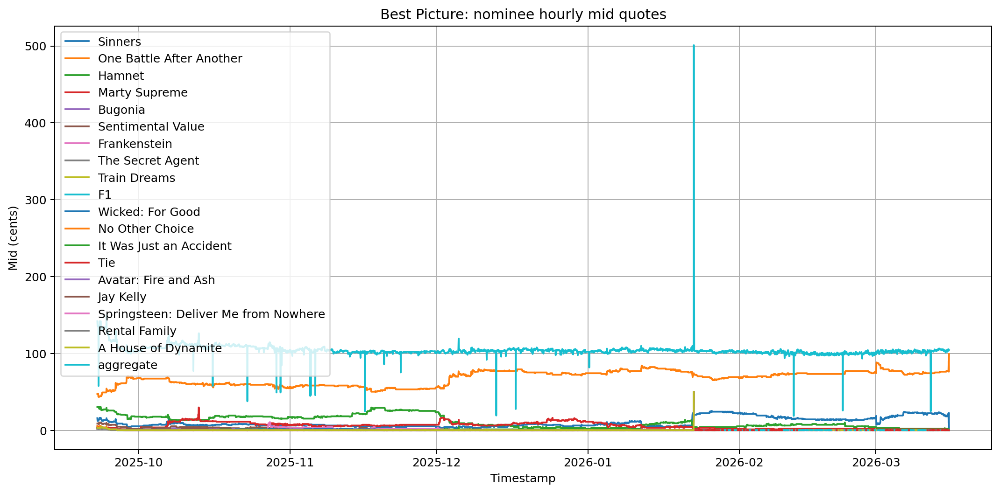

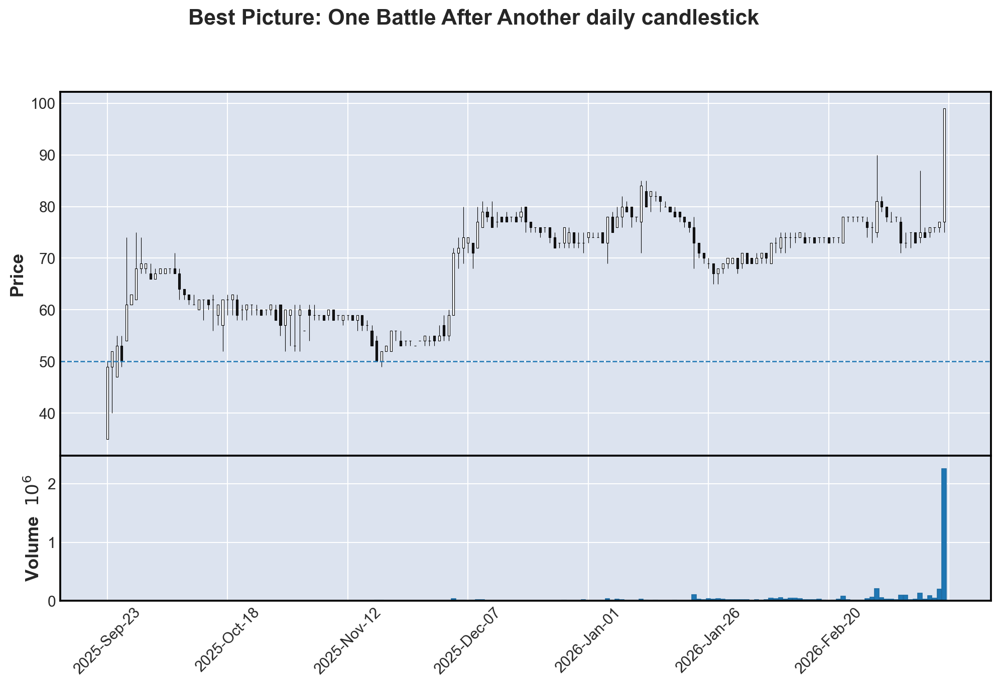

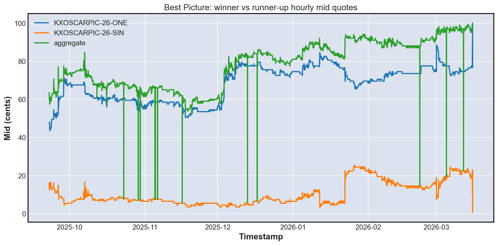

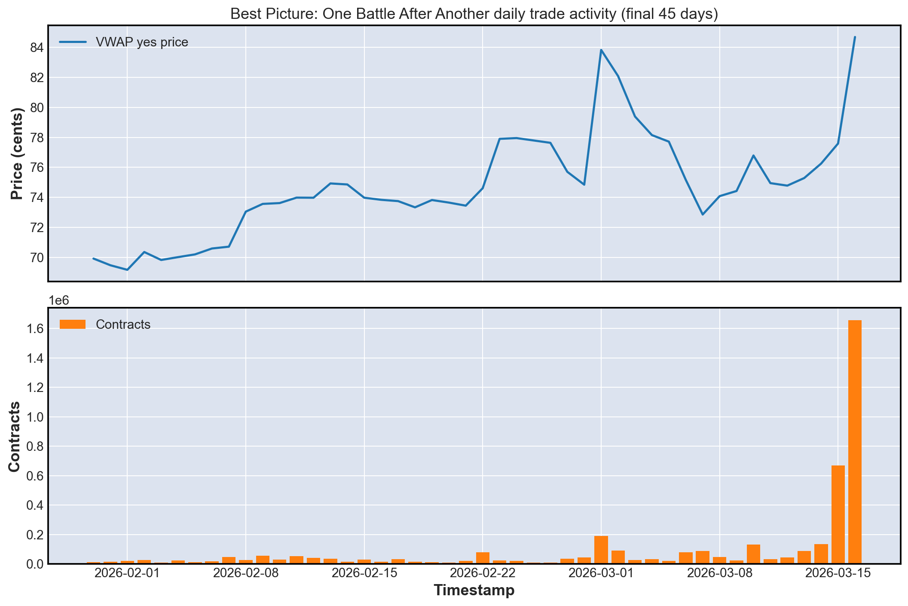

## Deep dive: Best Actor

- Event: `KXOSCARACTO-26`
- Winner: **Michael B. Jordan**
- Favorite just before settlement: **Michael B. Jordan** at 73.0c
- Runner-up just before settlement: **Timothee Chalamet** at 20.0c

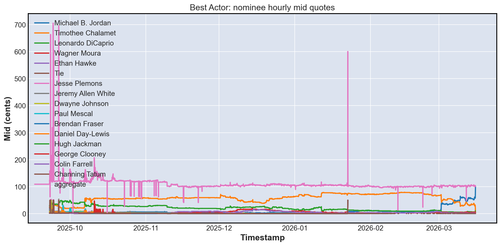

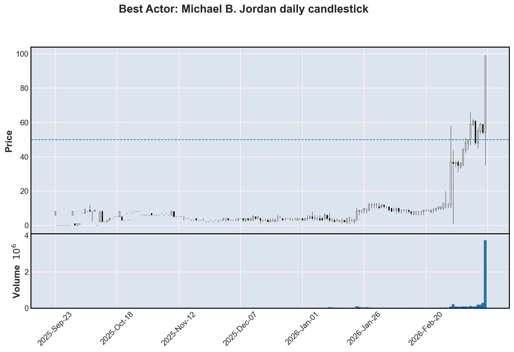

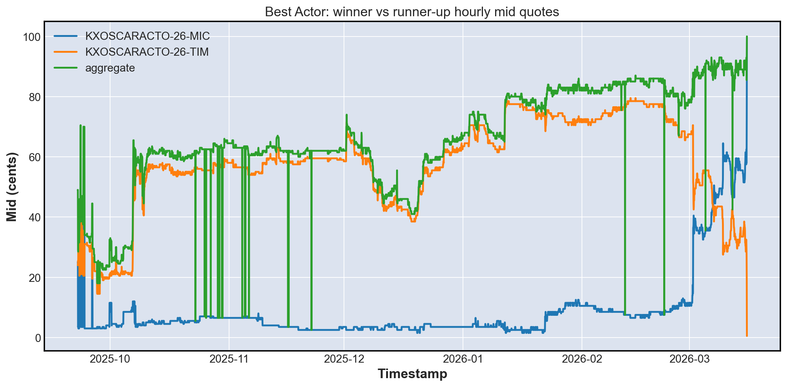

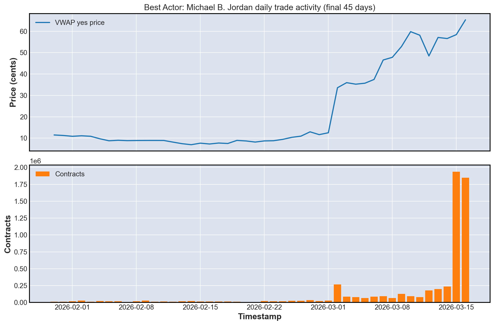

## Deep dive: Best Actress

- Event: `KXOSCARACTR-26`
- Winner: **Jessie Buckley**
- Favorite just before settlement: **Jessie Buckley** at 99.0c
- Runner-up just before settlement: **Rose Byrne** at 2.0c

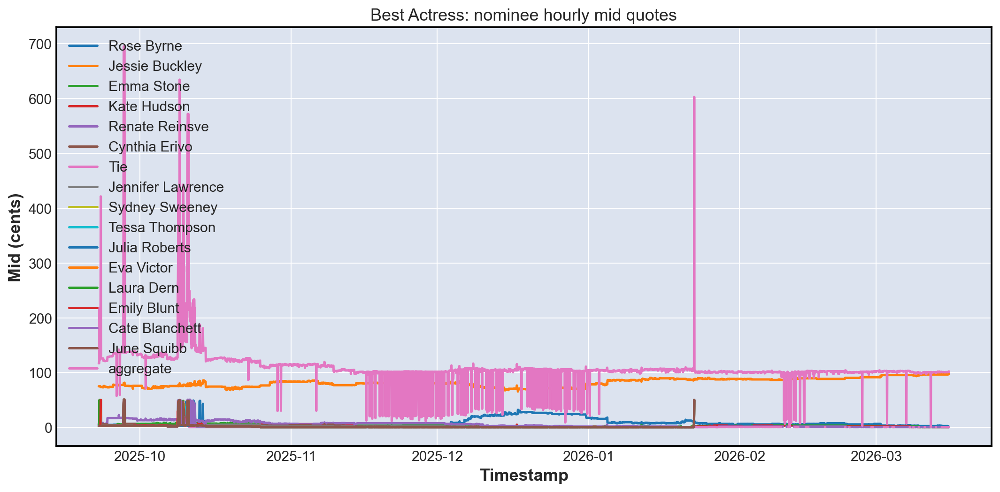

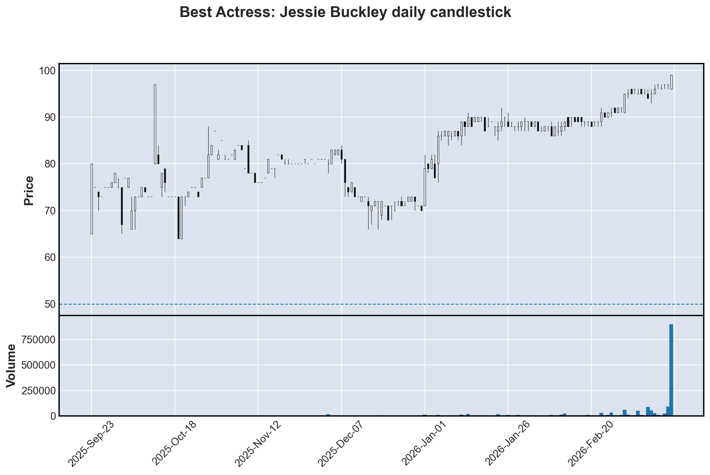

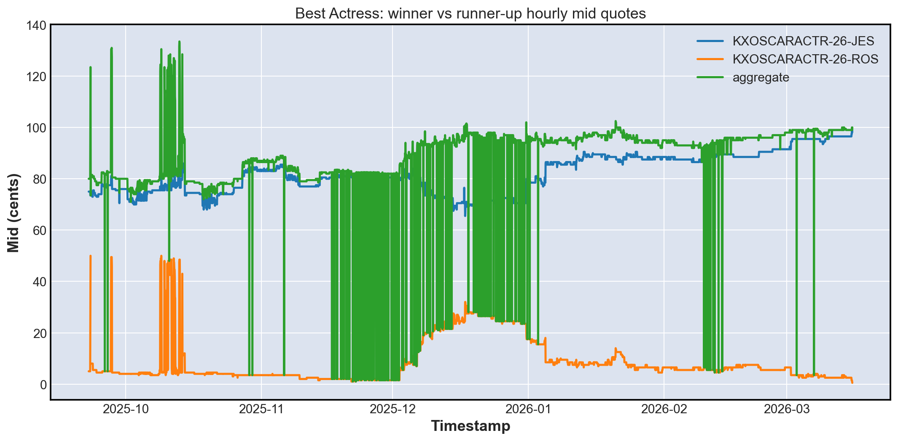

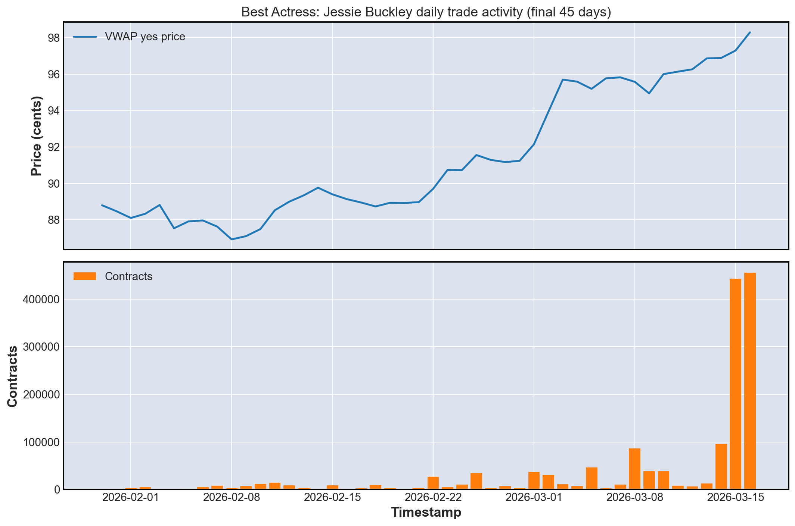

## Live order book check on the next Oscars cycle

This is not historical March 2026 depth. It is a live sanity check showing that the new order-book inspection tooling works on current Oscars futures too.

- Market: `KXOSCARPIC-27-ODY`
- Nominee: **The Odyssey**
- Current quoted YES mid: 17.0c

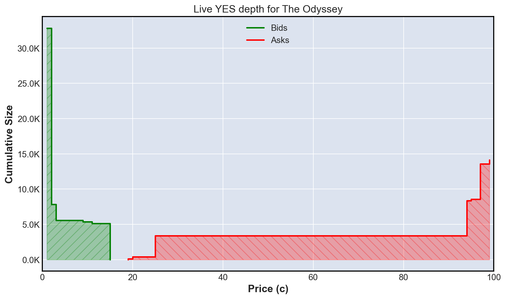

```text
Ticker: KXOSCARPIC-27-ODY
Bids:
  YES @ 1c x 25,000.00 contracts
  YES @ 2c x 2,262.00 contracts
  YES @ 3c x 200.00 contracts
  YES @ 9c x 250.00 contracts
  YES @ 11c x 125.00 contracts
  YES @ 15c x 5,000.00 contracts
Asks:
  YES @ 19c x 125.00 contracts
  YES @ 20c x 250.00 contracts
  YES @ 25c x 3,000.00 contracts
  YES @ 94c x 5,000.00 contracts
  YES @ 95c x 200.00 contracts
  YES @ 97c x 5,000.00 contracts
  YES @ 99c x 550.00 contracts
```

## What the current code can and cannot do here

Can do now:
- pull recurring Oscars series and select the recent finalized category event
- analyze nominee-level quote and candlestick dynamics per category
- download full trade histories for specific nominee markets
- summarize cross-category favorites, winners, and trading intensity
- inspect current live Oscars order book depth

Cannot do now unless data was captured in advance:
- reconstruct historical Oscars order-book microstructure from settlement week
- replay quote-by-quote or depth-by-depth Oscar dynamics after the fact without a stored websocket session

